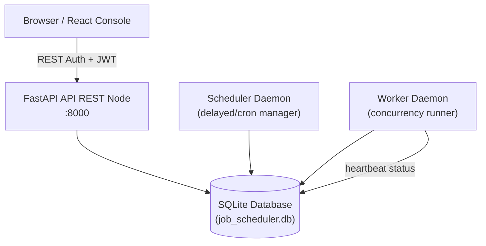

# JobFlow — Distributed Job Scheduler

A production grade distributed job scheduling platform built to demonstrate backend engineering excellence: clean architecture, atomic operations, observability, and reliable job execution at scale.

**Developed by: Prateek Sinha**

---

## Key Features
*   **Atomic Claiming**: Lock-free concurrent claiming on SQLite using optimistic locking checks (with postgres `SKIP LOCKED` fallbacks).
*   **Split-Service Architecture**: Separation of concerns between API service, Scheduler daemon, and Worker daemon.
*   **Real-time Observability**: Built-in React dashboard displaying queue health, node utilization, timelines, and line charts.
*   **Retry Strategies**: Configurable retry policies (fixed, linear, exponential backoff) with automated Dead Letter Queueing (DLQ).
*   **Zero Complex DB Configs**: Runs locally out-of-the-box using SQLite (`aiosqlite`) and a standalone file structure.

---

## System Architecture



### Service Responsibilities

| Daemon Service | Responsibility |
|:---|:---|
| **FastAPI REST API** | Accepts requests. CRUD operations for projects, queues, jobs. Exposes analytics. |
| **Scheduler Daemon** | Scans for delayed/scheduled jobs, schedules periodic Cron jobs, cleans up dead worker nodes. **Never executes payloads.** |
| **Worker Daemon** | Polls queues. Claims jobs atomically. Executes tasks concurrently via async loops. Writes console logs. **Never schedules.** |

---

## Tech Stack
*   **Backend**: Python 3.10+, FastAPI, SQLAlchemy 2.0 (async), Alembic, aiosqlite, structlog
*   **Frontend**: React 18, TypeScript, Vite, Vanilla CSS, Lucide icons, TanStack React Query, React Router
*   **Database**: SQLite (`job_scheduler.db`)

---

## Setup & Quick Start

Ensure you have a terminal open in the repository directory.

### 1. Initialize Backend
```bash
cd backend

# Create and activate virtual environment
python -m venv myenv
myenv\Scripts\activate   # On Windows
# source myenv/bin/activate # On macOS/Linux

# Install dependencies
pip install -r requirements.txt

# Run migrations to generate the local SQLite database file
alembic upgrade head
```

### 2. Start Services (2 Terminals)

**Terminal 1 (Backend stack):**
Run this script to start the API, Scheduler daemon, and Worker daemon concurrently in a single console terminal:
```bash
# Inside backend/ folder
python run_backend.py
```
*Press **Ctrl+C** to stop all three processes cleanly.*

**Terminal 2 (Frontend React console):**
```bash
cd frontend
npm install
npm run dev
```
Open [http://localhost:5173](http://localhost:5173) to explore the system!

---

## License & Author
Developed and maintained as an original work by **Prateek Sinha**. 
Licensed under the MIT License.
